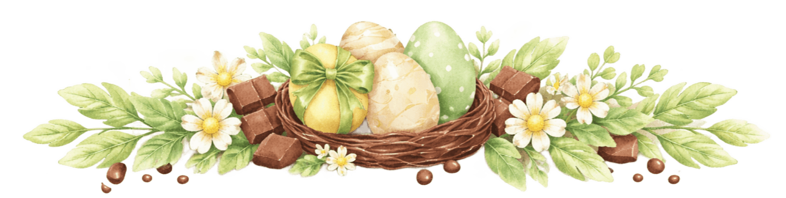
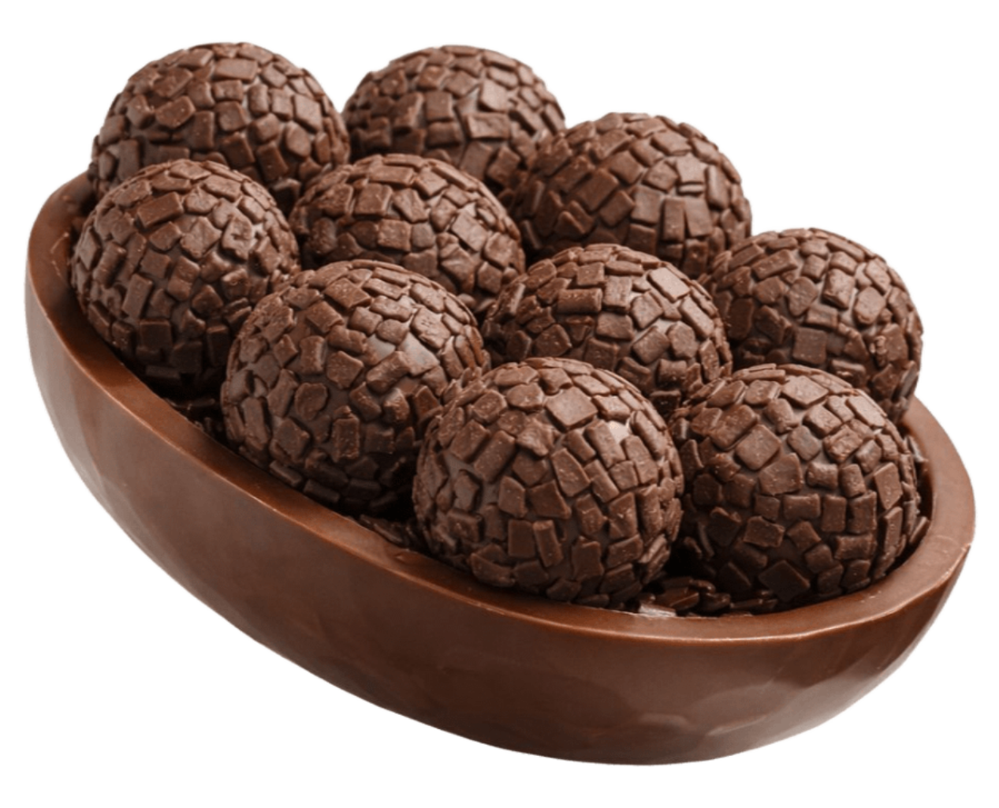
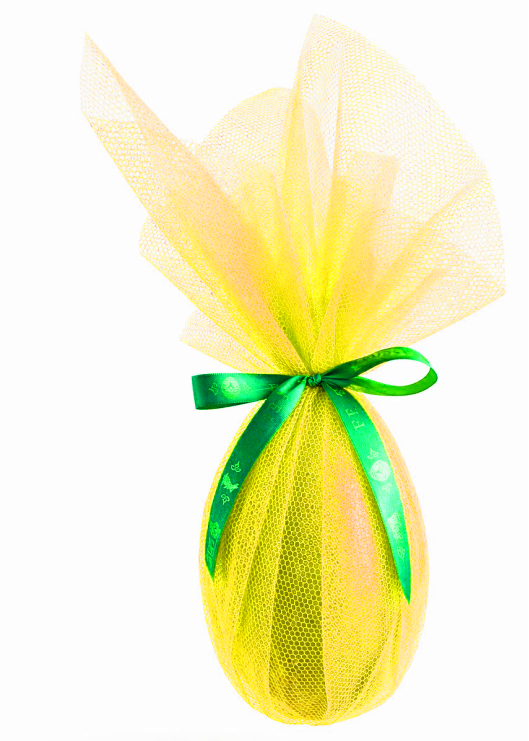
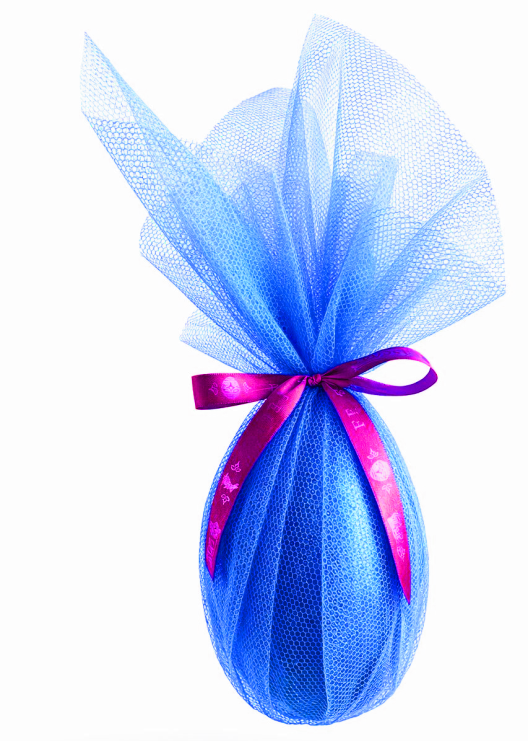
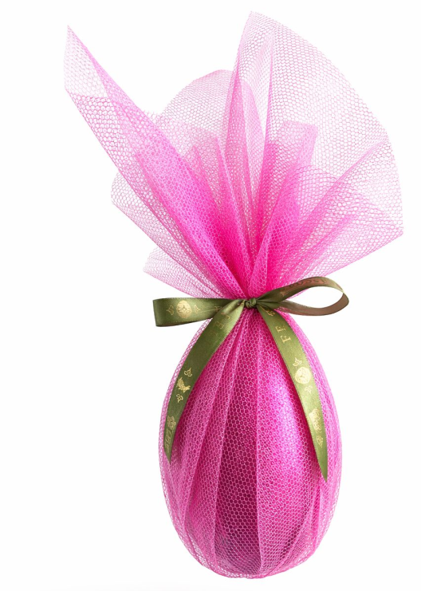
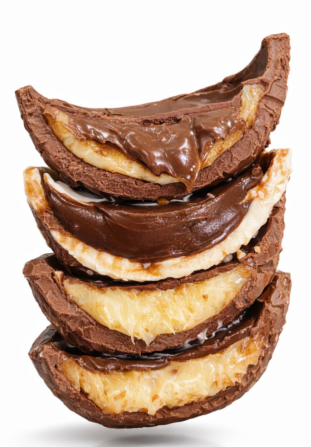
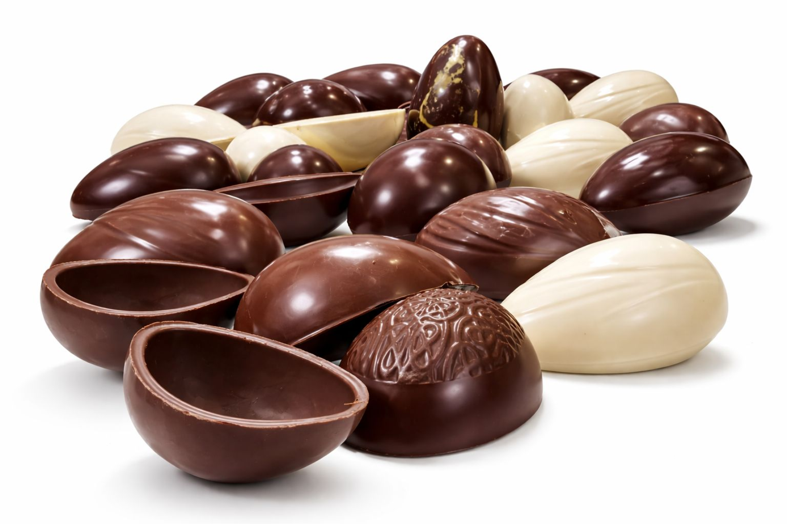

# Cardápio de Páscoa - Reformulado

## index.html

```html
<!DOCTYPE html>
<html lang="pt-BR">
<head>
  <meta charset="UTF-8">
  <meta name="viewport" content="width=device-width, initial-scale=1.0">
  <title>Cardápio de Páscoa - Aldo Lanches</title>
  <link rel="stylesheet" href="./style.css">
</head>
<body>

  <!-- FUNDO FIXO LISTRADO -->
  <div class="bg-fixed"></div>

  <!-- CONTAINER PRINCIPAL -->
  <div class="container-principal">

    <!-- CABEÇALHO -->
    <header class="header">
      
      <div class="header-deco">
        
      </div>
      <h1 class="titulo-principal">Cardápio de Páscoa</h1>
      
    </header>

    <!-- OVOS DE COLHER -->
    <section class="secao secao-colher" id="secao-colher">
      <div class="secao-titulo-wrap">
        <h2>🥄 Ovos de Colher</h2>
        <span class="secao-peso">aprox. 800g</span>
      </div>
      <div class="colher-layout">
        <div class="colher-img-lateral colher-img-esquerda">
          
        </div>
        <div class="colher-lista" id="ovos-colher"></div>
        <div class="colher-img-lateral colher-img-direita">
          
        </div>
      </div>
    </section>

    <!-- OVOS TRUFADOS -->
    <section class="secao secao-trufados" id="secao-trufados">
      <div class="secao-titulo-wrap">
        <h2>🍫 Ovos Trufados</h2>
        <span class="secao-peso">aprox. 800g</span>
      </div>
      <div class="trufados-layout">
        <div class="trufados-imagens">
          
          
          
        </div>
        <div class="trufados-perfil-wrap">
          
        </div>
        <div class="trufados-lista" id="ovos-trufados"></div>
      </div>
    </section>

    <!-- OVOS TRADICIONAIS -->
    <section class="secao secao-tradicionais" id="secao-tradicionais">
      <div class="secao-titulo-wrap">
        <h2>🥚 Ovos Tradicionais</h2>
      </div>
      <div class="tradicionais-layout">
        <div class="tradicionais-imagens">
          
          
        </div>
        <div class="tradicionais-lista" id="ovos-tradicionais"></div>
      </div>
    </section>

    <!-- AVISO -->
    <section class="secao secao-aviso">
      <div class="aviso-card">
        <h2>📋 Informações Importantes</h2>
        <p>Olá, queridos clientes!</p>
        <p>Caso não encontre no cardápio exatamente o que deseja, você pode montar seu pedido da forma que preferir — será um prazer preparar algo especial para você!</p>
        <p>Os pedidos devem ser feitos com <strong>antecedência até o dia 1º de abril</strong>, com pagamento de <strong>50% no ato do pedido</strong> e os outros <strong>50% na retirada</strong>.</p>
      </div>
    </section>

    <!-- MENSAGEM FINAL -->
    <section class="secao secao-final">
      <div class="final-card">
        
        <p>Desejamos a você uma Páscoa doce, cheia de amor, renovação e momentos especiais ao lado de quem você ama. Que nunca falte carinho, esperança e, claro, muito chocolate!</p>
        <p class="assinatura">Com carinho, Aldo Lanches 🐰🍫</p>
      </div>
    </section>

  </div>

  <!-- BOTÃO WHATSAPP FIXO -->
  <a href="#" id="btn-whatsapp-fixo" class="btn-whatsapp-fixo" target="_blank" rel="noopener">
    <svg viewBox="0 0 32 32" width="28" height="28" fill="#fff"><path d="M16.01 2.93A13.07 13.07 0 0 0 2.93 16a12.94 12.94 0 0 0 1.74 6.53L2.84 29.16l6.83-1.79A13.06 13.06 0 1 0 16.01 2.93zm0 23.93a10.82 10.82 0 0 1-5.52-1.51l-.4-.23-4.05 1.06 1.08-3.94-.26-.41a10.87 10.87 0 1 1 9.15 5.03zm5.96-8.13c-.33-.16-1.93-.95-2.23-1.06s-.52-.16-.73.17-.84 1.06-1.03 1.28-.38.25-.71.08a8.93 8.93 0 0 1-2.64-1.63 9.87 9.87 0 0 1-1.82-2.26c-.19-.33 0-.5.14-.67.14-.15.33-.38.49-.58s.22-.33.33-.55a.6.6 0 0 0-.03-.58c-.08-.16-.73-1.76-.99-2.41s-.52-.55-.73-.56h-.62a1.2 1.2 0 0 0-.87.41 3.64 3.64 0 0 0-1.13 2.71 6.34 6.34 0 0 0 1.33 3.37 14.53 14.53 0 0 0 5.57 4.92 18.7 18.7 0 0 0 1.86.69 4.47 4.47 0 0 0 2.06.13 3.36 3.36 0 0 0 2.2-1.55 2.71 2.71 0 0 0 .19-1.55c-.08-.14-.3-.22-.63-.38z"/></svg>
    <span>Fazer Pedido</span>
  </a>

  <script src="./app.js"></script>
</body>
</html>
```

## style.css

```css
/* ========== FONTES ========== */
@font-face {
  font-family: 'FonteTitulos';
  src: url('./Fonte dos titulos.ttf') format('truetype');
}
@font-face {
  font-family: 'FonteTexto';
  src: url('./Fonte do texto Semi Bold.ttf') format('truetype');
}
@font-face {
  font-family: 'FonteTextoItalic';
  src: url('./Fonte do texto Semi Bold Italic.ttf') format('truetype');
  font-style: italic;
}

/* ========== RESET ========== */
*, *::before, *::after {
  box-sizing: border-box;
  margin: 0;
  padding: 0;
}

/* ========== FUNDO FIXO LISTRADO ========== */
.bg-fixed {
  position: fixed;
  top: 0; left: 0;
  width: 100%; height: 100%;
  background-image: url('assets/bg-master-fixo-listras.png');
  background-size: cover;
  background-position: center;
  background-repeat: repeat;
  z-index: -2;
}

/* ========== BODY ========== */
body {
  font-family: 'FonteTexto', 'Segoe UI', Arial, sans-serif;
  margin: 0; padding: 0;
  color: #526947;
  min-height: 100vh;
  overflow-x: hidden;
}

/* ========== CONTAINER PRINCIPAL ========== */
.container-principal {
  max-width: 520px;
  margin: 0 auto;
  padding: 0;
}

/* ========== CABEÇALHO ========== */
.header {
  background: #EAEDD8;
  text-align: center;
  padding: 1.5rem 1rem 0.5rem 1rem;
  border-radius: 0 0 32px 32px;
}

.logo {
  max-width: 170px;
  width: 50%;
  display: block;
  margin: 0 auto 0.75rem auto;
  filter: drop-shadow(0 2px 6px rgba(82,105,71,0.12));
}

.header-deco {
  width: 100%;
  overflow: hidden;
  border-radius: 16px;
  margin-bottom: 0.75rem;
}

.header-img {
  width: 100%;
  display: block;
}

.titulo-principal {
  font-family: 'FonteTitulos', Georgia, serif;
  color: #7C9E6C;
  font-size: clamp(1.8rem, 7vw, 3rem);
  margin: 0.5rem 0 0.25rem 0;
  letter-spacing: 0.5px;
}

.coelho-hero {
  max-width: 130px;
  width: 35%;
  margin: 0 auto;
  display: block;
  filter: drop-shadow(0 3px 10px rgba(82,105,71,0.12));
  animation: floatCoelho 3s ease-in-out infinite;
}

@keyframes floatCoelho {
  0%, 100% { transform: translateY(0); }
  50% { transform: translateY(-8px); }
}

/* ========== SEÇÕES ========== */
.secao {
  background: #EAEDD8;
  margin: 1rem 0;
  padding: 1.5rem 1rem;
  border-radius: 24px;
}

.secao-titulo-wrap {
  text-align: center;
  margin-bottom: 1.25rem;
}

.secao-titulo-wrap h2 {
  font-family: 'FonteTitulos', Georgia, serif;
  color: #7C9E6C;
  font-size: clamp(1.4rem, 5.5vw, 2.2rem);
  margin-bottom: 0.15rem;
}

.secao-titulo-wrap h2::after {
  content: '';
  display: block;
  width: 50%;
  height: 2.5px;
  background: linear-gradient(90deg, transparent, #7C9E6C, transparent);
  margin: 0.35rem auto 0 auto;
  border-radius: 2px;
}

.secao-peso {
  font-family: 'FonteTextoItalic', 'FonteTexto', Arial, sans-serif;
  font-style: italic;
  color: #7C9E6C;
  font-size: 0.9rem;
}

/* ====================================================
   OVOS DE COLHER — LAYOUT
   ==================================================== */
.colher-layout {
  position: relative;
}

/* Imagens laterais — só desktop */
.colher-img-lateral {
  display: none;
}

/* Mobile: imagem de topo */
.colher-layout::before {
  content: '';
  display: block;
}

.colher-img-esquerda img,
.colher-img-direita img {
  width: 100%;
  max-width: 140px;
  filter: drop-shadow(0 4px 14px rgba(82,105,71,0.15));
  opacity: 0.25;
}

/* ========== CARD SABOR (Colher) ========== */
.card-sabor {
  background: #fff;
  border-radius: 16px;
  padding: 1rem 1.1rem;
  margin-bottom: 0.85rem;
  box-shadow: 0 2px 10px rgba(82,105,71,0.07);
  border-left: 4px solid #7C9E6C;
  transition: transform 0.2s ease, box-shadow 0.2s ease;
  position: relative;
  overflow: hidden;
}

.card-sabor:active {
  transform: scale(0.98);
}

.card-sabor:hover {
  box-shadow: 0 4px 20px rgba(82,105,71,0.14);
  transform: translateY(-2px);
}

.card-sabor-top {
  display: flex;
  justify-content: space-between;
  align-items: center;
  margin-bottom: 0.3rem;
}

.sabor-nome {
  font-family: 'FonteTitulos', Georgia, serif;
  font-size: 1.15rem;
  color: #526947;
}

.sabor-preco {
  font-family: 'FonteTexto', Arial, sans-serif;
  font-size: 1.2rem;
  font-weight: bold;
  color: #7C9E6C;
  white-space: nowrap;
}

.sabor-casca {
  font-family: 'FonteTextoItalic', 'FonteTexto', Arial, sans-serif;
  font-style: italic;
  font-size: 0.82rem;
  color: #7C9E6C;
  margin-bottom: 0.25rem;
}

.sabor-desc {
  font-size: 0.88rem;
  color: #526947;
  line-height: 1.45;
  margin-bottom: 0.6rem;
}

.sabor-link-pedir {
  display: inline-flex;
  align-items: center;
  gap: 0.35rem;
  color: #25D366;
  font-family: 'FonteTexto', Arial, sans-serif;
  font-size: 0.85rem;
  font-weight: bold;
  text-decoration: none;
  transition: color 0.2s;
}

.sabor-link-pedir:hover {
  color: #1da851;
}

.sabor-link-pedir svg {
  width: 16px; height: 16px; fill: #25D366;
}

.sabor-link-pedir:hover svg {
  fill: #1da851;
}

/* Toque para pedir — indicador mobile */
.card-sabor .pedir-hint {
  position: absolute;
  top: 0.6rem; right: 0.6rem;
  background: #25D366;
  color: #fff;
  font-size: 0.65rem;
  padding: 0.2rem 0.5rem;
  border-radius: 8px;
  font-family: 'FonteTexto', Arial, sans-serif;
  opacity: 0;
  animation: pulseHint 4s ease-in-out infinite;
}

@keyframes pulseHint {
  0%, 70%, 100% { opacity: 0; transform: scale(0.95); }
  80%, 90% { opacity: 1; transform: scale(1); }
}

/* ====================================================
   OVOS TRUFADOS — LAYOUT
   ==================================================== */
.trufados-layout {
  text-align: center;
}

.trufados-imagens {
  display: flex;
  justify-content: center;
  align-items: flex-end;
  gap: 0.5rem;
  margin-bottom: 1rem;
}

.img-trufado {
  width: 28%;
  max-width: 110px;
  filter: drop-shadow(0 3px 10px rgba(82,105,71,0.12));
  mix-blend-mode: multiply;
  transition: transform 0.25s ease;
}

.img-trufado:nth-child(2) {
  transform: translateY(-8px);
}

.img-trufado:hover {
  transform: scale(1.08);
}

.trufados-perfil-wrap {
  margin-bottom: 1.25rem;
}

.img-perfil {
  width: 85%;
  max-width: 320px;
  filter: drop-shadow(0 3px 10px rgba(82,105,71,0.1));
  mix-blend-mode: multiply;
  border-radius: 12px;
}

.trufados-preco-destaque {
  font-family: 'FonteTexto', Arial, sans-serif;
  font-size: 1.8rem;
  font-weight: bold;
  color: #7C9E6C;
  margin-bottom: 0.75rem;
}

.trufados-sabores-grid {
  display: grid;
  grid-template-columns: 1fr;
  gap: 0.6rem;
  max-width: 340px;
  margin: 0 auto;
}

.card-trufado-sabor {
  background: #fff;
  border-radius: 14px;
  padding: 0.85rem 1rem;
  display: flex;
  justify-content: space-between;
  align-items: center;
  box-shadow: 0 2px 8px rgba(82,105,71,0.06);
  border-left: 4px solid #7C9E6C;
  transition: transform 0.2s ease, box-shadow 0.2s ease;
}

.card-trufado-sabor:hover {
  transform: translateY(-2px);
  box-shadow: 0 4px 16px rgba(82,105,71,0.12);
}

.card-trufado-sabor:active {
  transform: scale(0.98);
}

.trufado-sabor-nome {
  font-family: 'FonteTitulos', Georgia, serif;
  font-size: 1.05rem;
  color: #526947;
}

.trufado-sabor-preco {
  font-size: 1.1rem;
  font-weight: bold;
  color: #7C9E6C;
  white-space: nowrap;
}

.trufado-pedir-link {
  display: inline-flex;
  align-items: center;
  gap: 0.3rem;
  color: #25D366;
  font-size: 0.78rem;
  font-weight: bold;
  text-decoration: none;
  margin-left: 0.5rem;
  flex-shrink: 0;
}

.trufado-pedir-link svg {
  width: 14px; height: 14px; fill: #25D366;
}

/* ====================================================
   OVOS TRADICIONAIS — LAYOUT
   ==================================================== */
.tradicionais-layout {
  text-align: center;
}

.tradicionais-imagens {
  display: flex;
  justify-content: center;
  align-items: center;
  gap: 1rem;
  margin-bottom: 1.25rem;
}

.img-trad-unico {
  width: 25%;
  max-width: 100px;
  filter: drop-shadow(0 3px 10px rgba(82,105,71,0.12));
  mix-blend-mode: multiply;
}

.img-trad-varios {
  width: 55%;
  max-width: 220px;
  filter: drop-shadow(0 3px 10px rgba(82,105,71,0.1));
  mix-blend-mode: multiply;
}

.tradicionais-grid {
  display: grid;
  grid-template-columns: 1fr 1fr;
  gap: 0.75rem;
  max-width: 360px;
  margin: 0 auto;
}

.card-tradicional {
  background: #fff;
  border-radius: 16px;
  padding: 1.1rem 0.85rem;
  text-align: center;
  box-shadow: 0 2px 10px rgba(82,105,71,0.07);
  border-top: 4px solid #7C9E6C;
  transition: transform 0.2s ease, box-shadow 0.2s ease;
}

.card-tradicional:hover {
  transform: translateY(-2px);
  box-shadow: 0 4px 18px rgba(82,105,71,0.14);
}

.trad-peso {
  font-family: 'FonteTextoItalic', 'FonteTexto', Arial, sans-serif;
  font-style: italic;
  font-size: 0.88rem;
  color: #7C9E6C;
  margin-bottom: 0.2rem;
}

.trad-preco {
  font-family: 'FonteTexto', Arial, sans-serif;
  font-size: 1.6rem;
  font-weight: bold;
  color: #7C9E6C;
  margin-bottom: 0.6rem;
}

.trad-pedir-link {
  display: inline-flex;
  align-items: center;
  gap: 0.3rem;
  background: #25D366;
  color: #fff;
  font-family: 'FonteTexto', Arial, sans-serif;
  font-size: 0.82rem;
  font-weight: bold;
  text-decoration: none;
  padding: 0.45rem 0.85rem;
  border-radius: 10px;
  transition: background 0.2s, transform 0.15s;
}

.trad-pedir-link:hover {
  background: #1da851;
  transform: scale(1.04);
}

.trad-pedir-link svg {
  width: 15px; height: 15px; fill: #fff;
}

/* ========== AVISO ========== */
.secao-aviso {
  background: #EAEDD8;
}

.aviso-card {
  background: #fff;
  border-radius: 18px;
  padding: 1.5rem 1.25rem;
  box-shadow: 0 2px 12px rgba(82,105,71,0.08);
  text-align: center;
  border: 2px dashed #7C9E6C;
}

.aviso-card h2 {
  font-family: 'FonteTitulos', Georgia, serif;
  color: #7C9E6C;
  font-size: 1.25rem;
  margin-bottom: 0.85rem;
}

.aviso-card h2::after {
  display: none;
}

.aviso-card p {
  margin-bottom: 0.65rem;
  line-height: 1.55;
  font-size: 0.92rem;
}

.aviso-card p:last-child {
  margin-bottom: 0;
}

/* ========== MENSAGEM FINAL ========== */
.secao-final {
  background: #EAEDD8;
  border-radius: 24px 24px 0 0;
  padding-bottom: 5rem;
}

.final-card {
  text-align: center;
  padding: 1rem 0;
}

.coelho-final {
  max-width: 90px;
  width: 22%;
  margin-bottom: 0.75rem;
  filter: drop-shadow(0 2px 6px rgba(82,105,71,0.1));
}

.final-card p {
  font-size: 0.95rem;
  line-height: 1.6;
  margin-bottom: 0.6rem;
}

.assinatura {
  font-family: 'FonteTitulos', Georgia, serif;
  font-size: 1.15rem;
  color: #7C9E6C;
}

/* ========== BOTÃO WHATSAPP FIXO ========== */
.btn-whatsapp-fixo {
  position: fixed;
  bottom: 1.25rem;
  right: 1.25rem;
  background: #25D366;
  color: #fff;
  border-radius: 50px;
  padding: 0.75rem 1.2rem;
  display: flex;
  align-items: center;
  gap: 0.45rem;
  text-decoration: none;
  font-family: 'FonteTexto', Arial, sans-serif;
  font-size: 0.95rem;
  font-weight: bold;
  box-shadow: 0 4px 20px rgba(37,211,102,0.35);
  z-index: 1000;
  transition: transform 0.2s ease, box-shadow 0.2s ease;
}

.btn-whatsapp-fixo:hover {
  transform: scale(1.06);
  box-shadow: 0 6px 28px rgba(37,211,102,0.45);
}

.btn-whatsapp-fixo svg {
  flex-shrink: 0;
}

/* ========== ANIMAÇÕES SCROLL ========== */
.fade-up {
  opacity: 0;
  transform: translateY(25px);
  transition: opacity 0.5s ease, transform 0.5s ease;
}

.fade-up.visible {
  opacity: 1;
  transform: translateY(0);
}

/* ====================================================
   DESKTOP (min-width: 768px)
   ==================================================== */
@media (min-width: 768px) {
  .container-principal {
    max-width: 680px;
  }

  /* Imagens laterais visíveis */
  .colher-layout {
    display: grid;
    grid-template-columns: 100px 1fr 100px;
    gap: 0.75rem;
    align-items: start;
  }

  .colher-img-lateral {
    display: flex;
    align-items: flex-start;
    justify-content: center;
    position: sticky;
    top: 2rem;
  }

  .colher-img-esquerda img {
    transform: rotate(-8deg);
  }

  .colher-img-direita img {
    transform: rotate(8deg) scaleX(-1);
  }

  .trufados-sabores-grid {
    grid-template-columns: 1fr 1fr;
    max-width: 450px;
  }

  .tradicionais-grid {
    max-width: 400px;
  }

  .secao {
    padding: 2rem 1.5rem;
    border-radius: 28px;
    margin: 1.25rem 0;
  }
}

/* ====================================================
   DESKTOP GRANDE (min-width: 1024px)
   ==================================================== */
@media (min-width: 1024px) {
  .container-principal {
    max-width: 780px;
  }

  .colher-layout {
    grid-template-columns: 130px 1fr 130px;
  }

  .colher-img-lateral img {
    max-width: 130px;
    opacity: 0.3;
  }
}

/* ====================================================
   MOBILE PEQUENO (max-width: 380px)
   ==================================================== */
@media (max-width: 380px) {
  .header {
    padding: 1rem 0.75rem 0.25rem 0.75rem;
  }

  .logo {
    max-width: 130px;
  }

  .titulo-principal {
    font-size: 1.5rem;
  }

  .coelho-hero {
    max-width: 100px;
  }

  .secao {
    padding: 1.15rem 0.75rem;
    margin: 0.6rem 0;
    border-radius: 18px;
  }

  .card-sabor {
    padding: 0.85rem 0.9rem;
  }

  .sabor-nome { font-size: 1.05rem; }
  .sabor-preco { font-size: 1.05rem; }

  .tradicionais-grid {
    grid-template-columns: 1fr 1fr;
    gap: 0.5rem;
  }

  .btn-whatsapp-fixo span {
    display: none;
  }

  .btn-whatsapp-fixo {
    padding: 0.85rem;
    border-radius: 50%;
  }
}
```

## app.js

```javascript
// ========== DADOS ==========

var WHATSAPP = '5579999003081';

var ovosColher = [
  {
    nome: 'Dueto',
    preco: 95,
    casca: 'Casca: escolher (ao leite ou branca)',
    desc: 'Combinação perfeita de chocolate ao leite e chocolate branco, com recheio cremoso dos dois chocolates. Finalizado com brigadeiros.'
  },
  {
    nome: 'Morango',
    preco: 95,
    casca: 'Casca: escolher (ao leite ou branca)',
    desc: 'Creme suave de morango, finalizado com morangos.'
  },
  {
    nome: 'Brigadeiro',
    preco: 90,
    casca: 'Casca de chocolate ao leite',
    desc: 'Recheada com brigadeiro cremoso e finalizada com brigadeiros gourmet.'
  },
  {
    nome: 'Morango com Chocolate',
    preco: 100,
    casca: 'Casca de chocolate ao leite',
    desc: 'Recheada com creme de morango e chocolate, finalizado com brigadeiro e morango.'
  },
  {
    nome: 'Kinder Bueno',
    preco: 115,
    casca: 'Casca ao leite (ou branca)',
    desc: 'Recheio cremoso inspirado no Kinder Bueno, com creme de avelã e chocolate ao leite. Finalizado com Kinder Bueno.'
  },
  {
    nome: 'Ferrero Rocher',
    preco: 115,
    casca: 'Casca ao leite',
    desc: 'Creme de avelã com chocolate, pedaços crocantes e finalizado no estilo Ferrero Rocher.'
  },
  {
    nome: 'Prestígio',
    preco: 90,
    casca: 'Casca meio amargo',
    desc: 'Recheio de coco cremoso com chocolate ao leite, clássico e irresistível. Finalizado com Prestígio.'
  },
  {
    nome: 'Maracujá com Brigadeiro',
    preco: 95,
    casca: 'Casca meio amargo',
    desc: 'Creme de maracujá levemente azedinho combinado com brigadeiro cremoso, finalizado com brigadeiro.'
  },
  {
    nome: 'Chokito',
    preco: 90,
    casca: 'Casca ao leite',
    desc: 'Creme crocante com chocolate, no estilo Chokito. Delicioso e irresistível.'
  },
  {
    nome: 'KitKat',
    preco: 110,
    casca: 'Casca ao leite',
    desc: 'Chocolate cremoso com pedaços crocantes de wafer tipo KitKat. Finalizado com KitKat.'
  },
  {
    nome: 'Matilde',
    preco: 100,
    casca: 'Casca meio amargo',
    desc: 'Creme de chocolate com bolo Matilde, finalizado com chocolate.'
  }
];

var trufadosSabores = [
  'Ninho com Nutella',
  'Brigadeiro',
  'Castanha',
  'Prestígio',
  'Morango'
];
var trufadoPreco = 90;

var tradicionais = [
  { peso: 'aprox. 250g', preco: 25 },
  { peso: 'aprox. 350g', preco: 60 }
];

// ========== HELPERS ==========

function linkZap(texto) {
  return 'https://wa.me/' + WHATSAPP + '?text=' + encodeURIComponent(texto);
}

function svgZap(w) {
  var s = w || 16;
  return '<svg viewBox="0 0 32 32" width="' + s + '" height="' + s + '" fill="currentColor"><path d="M16.01 2.93A13.07 13.07 0 0 0 2.93 16a12.94 12.94 0 0 0 1.74 6.53L2.84 29.16l6.83-1.79A13.06 13.06 0 1 0 16.01 2.93zm0 23.93a10.82 10.82 0 0 1-5.52-1.51l-.4-.23-4.05 1.06 1.08-3.94-.26-.41a10.87 10.87 0 1 1 9.15 5.03zm5.96-8.13c-.33-.16-1.93-.95-2.23-1.06s-.52-.16-.73.17-.84 1.06-1.03 1.28-.38.25-.71.08a8.93 8.93 0 0 1-2.64-1.63 9.87 9.87 0 0 1-1.82-2.26c-.19-.33 0-.5.14-.67.14-.15.33-.38.49-.58s.22-.33.33-.55a.6.6 0 0 0-.03-.58c-.08-.16-.73-1.76-.99-2.41s-.52-.55-.73-.56h-.62a1.2 1.2 0 0 0-.87.41 3.64 3.64 0 0 0-1.13 2.71 6.34 6.34 0 0 0 1.33 3.37 14.53 14.53 0 0 0 5.57 4.92 18.7 18.7 0 0 0 1.86.69 4.47 4.47 0 0 0 2.06.13 3.36 3.36 0 0 0 2.2-1.55 2.71 2.71 0 0 0 .19-1.55c-.08-.14-.3-.22-.63-.38z"/></svg>';
}

// ========== RENDER OVOS DE COLHER ==========

function renderColher() {
  var container = document.getElementById('ovos-colher');
  if (!container) return;

  ovosColher.forEach(function(item, i) {
    var msg = 'Olá! Gostaria de pedir um *Ovo de Colher - ' + item.nome + '* (R$' + item.preco + ') do Cardápio de Páscoa 🐰🍫 da Confeitaria Aldo Lanches!';
    var href = linkZap(msg);

    var div = document.createElement('div');
    div.className = 'card-sabor fade-up';
    div.style.transitionDelay = (i * 0.06) + 's';

    div.innerHTML =
      '<span class="pedir-hint">Toque para pedir</span>' +
      '<div class="card-sabor-top">' +
        '<a href="' + href + '" target="_blank" rel="noopener" class="sabor-nome" title="Clique para pedir ' + item.nome + '">' + item.nome + '</a>' +
        '<span class="sabor-preco">R$ ' + item.preco + '</span>' +
      '</div>' +
      '<div class="sabor-casca">' + item.casca + '</div>' +
      '<div class="sabor-desc">' + item.desc + '</div>' +
      '<a href="' + href + '" target="_blank" rel="noopener" class="sabor-link-pedir">' +
        svgZap(16) +
        ' Pedir agora' +
      '</a>';

    container.appendChild(div);
  });
}

// ========== RENDER OVOS TRUFADOS ==========

function renderTrufados() {
  var container = document.getElementById('ovos-trufados');
  if (!container) return;

  // Preço destaque
  var precoDiv = document.createElement('div');
  precoDiv.className = 'trufados-preco-destaque fade-up';
  precoDiv.textContent = 'R$ ' + trufadoPreco;
  container.appendChild(precoDiv);

  // Subtítulo
  var sub = document.createElement('p');
  sub.style.cssText = 'text-align:center;margin-bottom:0.85rem;font-size:0.92rem;color:#526947;';
  sub.textContent = 'Escolha seu sabor e clique para pedir:';
  sub.className = 'fade-up';
  container.appendChild(sub);

  // Grid de sabores
  var grid = document.createElement('div');
  grid.className = 'trufados-sabores-grid';

  trufadosSabores.forEach(function(sabor, i) {
    var msg = 'Olá! Gostaria de pedir um *Ovo Trufado - ' + sabor + '* (R$' + trufadoPreco + ') do Cardápio de Páscoa 🐰🍫 da Confeitaria Aldo Lanches!';
    var href = linkZap(msg);

    var card = document.createElement('a');
    card.href = href;
    card.target = '_blank';
    card.rel = 'noopener';
    card.className = 'card-trufado-sabor fade-up';
    card.style.textDecoration = 'none';
    card.style.transitionDelay = (i * 0.07) + 's';
    card.title = 'Clique para pedir ' + sabor;

    card.innerHTML =
      '<span class="trufado-sabor-nome">🍫 ' + sabor + '</span>' +
      '<span class="trufado-pedir-link">' +
        svgZap(14) +
        ' Pedir' +
      '</span>';

    grid.appendChild(card);
  });

  container.appendChild(grid);
}

// ========== RENDER OVOS TRADICIONAIS ==========

function renderTradicionais() {
  var container = document.getElementById('ovos-tradicionais');
  if (!container) return;

  var grid = document.createElement('div');
  grid.className = 'tradicionais-grid';

  tradicionais.forEach(function(item, i) {
    var msg = 'Olá! Gostaria de pedir um *Ovo Tradicional* (' + item.peso + ' - R$' + item.preco + ') do Cardápio de Páscoa 🐰🍫 da Confeitaria Aldo Lanches!';
    var href = linkZap(msg);

    var card = document.createElement('div');
    card.className = 'card-tradicional fade-up';
    card.style.transitionDelay = (i * 0.1) + 's';

    card.innerHTML =
      '<div class="trad-peso">' + item.peso + '</div>' +
      '<div class="trad-preco">R$ ' + item.preco + '</div>' +
      '<a href="' + href + '" target="_blank" rel="noopener" class="trad-pedir-link" title="Clique para pedir">' +
        svgZap(15) +
        ' Pedir agora' +
      '</a>';

    grid.appendChild(card);
  });

  container.appendChild(grid);
}

// ========== ANIMAÇÃO DE SCROLL ==========

function initScrollAnim() {
  var els = document.querySelectorAll('.fade-up');
  if (!els.length) return;

  if (!('IntersectionObserver' in window)) {
    // Fallback: mostra tudo
    els.forEach(function(el) { el.classList.add('visible'); });
    return;
  }

  var observer = new IntersectionObserver(function(entries) {
    entries.forEach(function(entry) {
      if (entry.isIntersecting) {
        entry.target.classList.add('visible');
      }
    });
  }, {
    threshold: 0.08,
    rootMargin: '0px 0px -40px 0px'
  });

  els.forEach(function(el) { observer.observe(el); });
}

// ========== BOTÃO WHATSAPP FIXO ==========

function initBtnZap() {
  var btn = document.getElementById('btn-whatsapp-fixo');
  if (!btn) return;
  var msg = 'Olá! Gostaria de fazer um pedido do Cardápio de Páscoa 🐰🍫 da Confeitaria Aldo Lanches!';
  btn.href = linkZap(msg);
}

// ========== INIT ==========

document.addEventListener('DOMContentLoaded', function() {
  renderColher();
  renderTrufados();
  renderTradicionais();
  initBtnZap();

  // Delay para animação funcionar após render
  requestAnimationFrame(function() {
    requestAnimationFrame(function() {
      initScrollAnim();
    });
  });
});
```

---

## Resumo do que foi feito:

| Recurso | Detalhes |
|---|---|
| **Fundo #EAEDD8** | Todas as seções usam `background: #EAEDD8` como área de conteúdo, sobre o fundo listrado fixo |
| **Ovos de Colher** | Cards brancos com borda verde, nome clicável + link "Pedir agora" via WhatsApp. Imagens decorativas nas laterais em desktop |
| **Ovos Trufados** | As 3 fotos (amarelo/azul/rosa) + perfil ficam integradas no fundo `#EAEDD8` junto com os sabores clicáveis |
| **Ovos Tradicionais** | Imagens integradas + cards com peso, preço e botão de pedir |
| **WhatsApp** | Cada item linka para `wa.me/5579999003081` com mensagem pré-formatada com nome e preço do produto |
| **Mobile first** | Layout otimizado para celular (max-width: 520px principal), adapta para desktop com media queries |
| **Animações** | Scroll reveal (fade-up), float no coelho, hover nos cards |